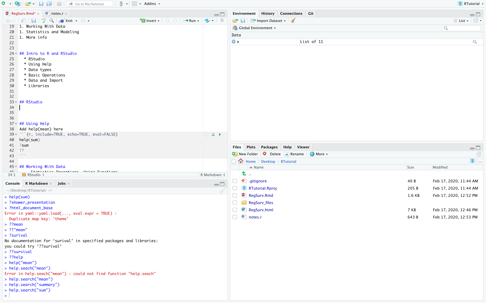
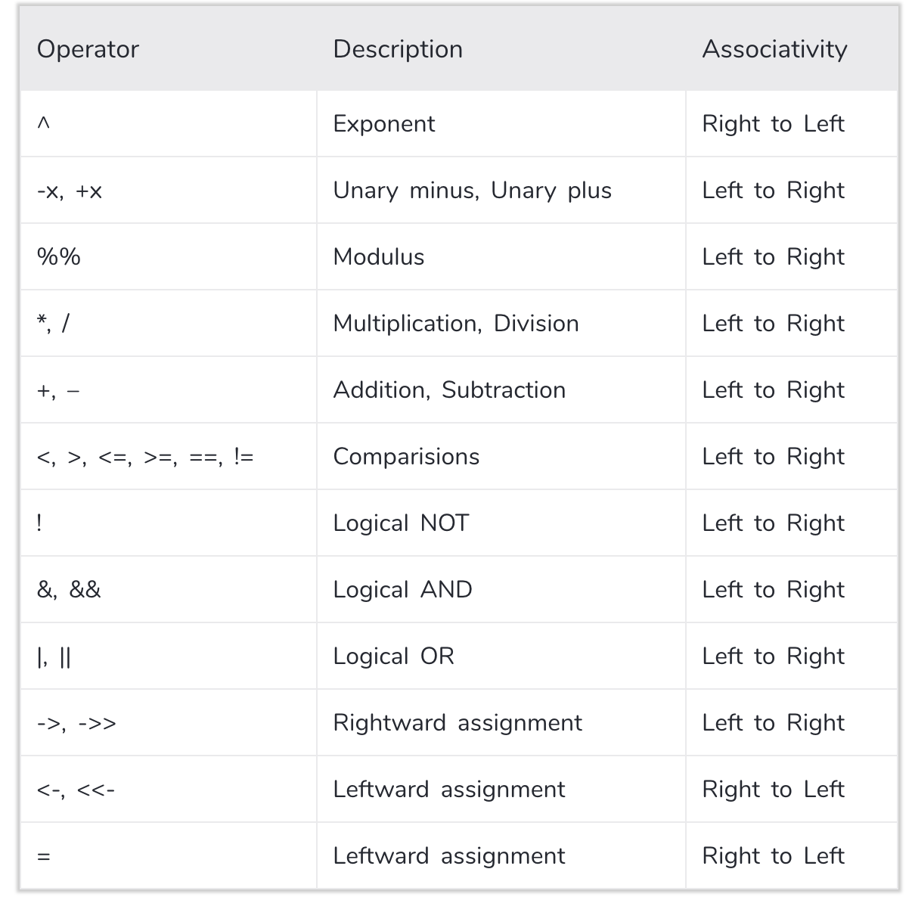

```{r setup, include=FALSE}
knitr::opts_chunk$set(echo = TRUE)
```

<style type="text/css">
.main-container {
  max-width: 1800px;
  margin-left: auto;
  margin-right: auto;
}
</style>

<style>
div.footnotes {
  position: absolute;
  bottom: 0;
  margin-bottom: 10px;
  width: 80%;
  font-size: 0.6em;
}
</style>

<script src="https://ajax.googleapis.com/ajax/libs/jquery/3.1.1/jquery.min.js"></script>
<script>
$(document).ready(function() {
  $('slide:not(.backdrop):not(.title-slide)').append('<div class=\"footnotes\">');

  $('footnote').each(function(index) {
    var text  = $(this).html();
    var fnNum = (index+1).toString();
    $(this).html(fnNum.sup());

    var footnote   = fnNum + '. ' + text + '<br/>';
    var oldContent = $(this).parents('slide').children('div.footnotes').html();
    var newContent = oldContent + footnote;
    $(this).parents('slide').children('div.footnotes').html(newContent);
  });
});
</script>


## Contents

1. Intro to R and RStudio
1. Working With Data
1. Statistics and Modeling
1. More info


## Intro to R and RStudio
  * RStudio
  * Using Help
  * Data types
  * Operations
  * Working with Data
  * Libraries


## RStudio
```{r, echo = FALSE, out.width="800px"}

```


## Using Help
Various functions for finding help
```{r, include=TRUE, echo=TRUE, eval=FALSE}
# Finding out help about specific functions
help(sum)
?sum

# Finding help about topics
??sum

# Operations requires backticks around
?`*`
```

## Data Types
Basic Data Types:

**Numeric:** Numbers *ex.* `1`, `1.43`, `1e10`

**Char**: Strings *ex.* `"cat"`, `"a"`, `"two words"`

**Factor**: Categorical Data *ex.* Male/Female, Age Ranges (10-19, 20-29, ...)

**Logical**: True/False values
  
Other types include: functions, expressions, object, etc.


## Data Types - Vectors
**Vector** combination of elements of the same type
```{r echo=TRUE, eval = FALSE}
c(1, 2, 3, 4)

1:3

c("cat", "dog", "horse", "cow")
```
```{r echo=TRUE}
factor(c("Male", "Female", "Male", "Male"))
```


## Data Types - Matrices
```{r echo=TRUE}
matrix(1:16, ncol = 4, byrow = T)
t(matrix(1:16, ncol = 4, byrow = T))
```


## Data Types - Data Frames
Contains nxp collection of vectors where element i refers to the ith observation
```{r echo=TRUE}
x <- data.frame(name = c("Alex", "Brad", "Catherine"),
                age = c(25, 46, 32),
                sex = factor("Male", "Male", "Female"))
print(x)
str(x)
```

## Data Types - Lists
Lists - collection of objects
```{r echo=TRUE}
list(parents = c("Jack", "Jill"),
     siblings = c("Nick", "Joe", "Kevin"),
     cars = data.frame(make = c("Ford", "Mazda"),
                       year = c(1999, 2003),
                       type = c("truck", "coupe")))
```


## Operations in R
Basic Operations
```{r echo=TRUE}
4 * 5
7 %% 5
3^2
log(5)
```

## Operations in R
Assignment
```{r echo=TRUE}
x <- 3 * 4 + 2
print(x)
family <- data.frame(name = c("Nick", "Joe", "Jill"),
                     relation = c("Brother", "Brother", "Mother"))
print(family)
```

## Operations in R
Assignment
```{r echo=TRUE}
x <- 3 * 4 + 2
print(x)
family <- data.frame(name = c("Nick", "Joe", "Jill"),
                     relation = c("Brother", "Brother", "Mother"))
print(family)
```

## Operations in R
Relational
```{r echo=TRUE}
x <- 5:9
y <- seq(2, 10, 2)
x > y
```
Logical
```{r echo=TRUE}
(x > y) | (x %% 2 == 0)
```

## Operation Precedence
```{r, echo = FALSE, out.height="400px", out.width = "350px"}

```
<footnote>datamentor.io/r-programming </footnote>

Tip: Use parentheses if unclear

## Programming Basics - indexing
```{r echo=TRUE}
x <- 10:20
print(x)
x[c(1, 2, 3)]
x[x%%2 == 0]            # select even values only
x[x%%2 == 0] <- NA      # Make even values NA
```


## Programming Basics - if/else statements
```{r echo=TRUE}
x <- -5
if(x > 0){
  print("positive")
} else if(x == 0){
  print("zero")
} else{
  print("negative")
}
ifelse(x > 0, "postive", "not positive")
```

## Programming Basics - for loop
```{r echo=TRUE}
x <- c(1, 2, 3, 4, 5)
for(i in x) print(i)
x <- c("A", "B", "C")
for(i in x) print(i)
for(i in seq_along(x)) print(x[i])
```

## Programming Basics - while loop
```{r echo=TRUE}
x <- 5
i <- 1
while(i < x){
  print(i^2)    # what to do
  i <- i + 1    # increment i
}
i <- 1
while(TRUE){
  print(i^2)        # what to do
  if(i >= x) break  # condition to break loop
  i <- i + 1        # increment i
}
```

## Working with Data
  * Data Frames and Indexing
  * Functions
  * Importing/Exporting Data
  * Data Manipulation
  * Plotting
  
## Cars dataset
```{r echo=TRUE}
data("mtcars")
head(mtcars)   # Shows top 6 observations
str(mtcars)    # Structure of data frame
```

## Cars dataset
```{r echo=TRUE}
summary(mtcars)    # Summary statistics of data frame
```

## Cars dataset
```{r echo=TRUE}
pairs(mtcars)    # Pairs plot to quickly see relationships
```

## Cars dataset
```{r echo=TRUE}
mtcars2 <- within(mtcars, {
   vs <- factor(vs, labels = c("V", "S"))
   am <- factor(am, labels = c("automatic", "manual"))
   cyl  <- ordered(cyl)
   gear <- ordered(gear)
   carb <- ordered(carb)
})
summary(mtcars2)
```

## Cars dataset
```{r echo=TRUE}
str(mtcars2)
```

## Indexing
```{r echo=TRUE}
mtcars2$mpg                    # Use $ to select specific variable
mtcars2$mpg[c(1, 2, 5, 7)]   # [] to slice data
mtcars2[mtcars$cyl == 6,]   # [] to slice data
```


## Functions
```{r echo=TRUE}
mean(mtcars2$mpg)      # Mean of a specific column
mean(mtcars2)          # Dataset contains mixed types
colSums(mtcars)        # Acts on each column individually
```

## Functions - Writing your own
```{r echo=TRUE, eval = FALSE}
function_name <- function(argument){
  code to perform function here
  return(return_value)
  # OR
  return_value
}
```

```{r echo=TRUE}
pow <- function(dat, val){
  # raises data vector (or matrix) to the val power
  dat^val
}
pow(mtcars2$mpg, 2.4)
```


## Importing/Exporting Data
```{r echo=TRUE}
lung <- read.csv("~/Desktop/RTutorial/lung_cancer.csv",
                 header = T,
                 stringsAsFactors = F)
str(lung)
```
```{r echo=TRUE, eval = FALSE}
write.table(lung, sep = "\t", file = "~/Desktop/lung2.txt")
```


## Data Manipulation
Primary Biliary Cirrhosis The data set found in appendix D of Fleming and Harrington, Counting Processes and Survival Analysis, Wiley, 1991

Variables:

  * case number 
  * number of days between registration and the earlier of death, transplantation, or study analysis time in July, 1986 
  * status 
  * drug: 1= D-penicillamine, 2=placebo 
  * age in days 
  * sex: 0=male, 1=female 
  * presence of ascites: 0=no 1=yes 
  * presence of hepatomegaly 0=no 1=yes 
  * presence of spiders 0=no 1=yes 
  * presence of edema 0=no edema and no diuretic therapy for edema; 
    .5 = edema present without diuretics, or edema resolved by diuretics; 
     1 = edema despite diuretic therapy 
  
  
## Data Manipulation
Primary Biliary Cirrhosis The data set found in appendix D of Fleming and Harrington, Counting Processes and Survival Analysis, Wiley, 1991

Variables (cont.):

  * serum bilirubin in mg/dl 
  * serum cholesterol in mg/dl 
  * albumin in gm/dl 
  * urine copper in ug/day 
  * alkaline phosphatase in U/liter 
  * SGOT in U/ml 
  * triglicerides in mg/dl 
  * platelets per cubic ml / 1000 
  * prothrombin time in seconds 
  * histologic stage of disease 


## Data Manipulation
First steps: Import data
```{r, echo=TRUE}
liver <- read.csv("~/Desktop/RTutorial/cirrhosis.csv",
                  header = T,
                  stringsAsFactors = F,
                  na.strings = ".")
```

List of Manipulations:

* Combine censored status (0 and 1 -> 0 and 2 -> 1)
* Convert non-numeric data to factors
* Change days to months

## Data Manipulation
Combining censored status
```{r, echo = TRUE}
table(liver$status)
liver$status <- ifelse(liver$status %in% c(0, 1), 0, 1)
```

Note: replaced status variable with updated version. Sometimes useful to
create a completely new variable or create a new copy of the dataset for
reproduceability.


## Data Manipulation
Changing binary and categorical data from numeric to factor / char
```{r, echo = TRUE}
liver$drug <- liver$drug == 1     # Turn into TRUE/FALSE where FALSE is placebo
liver <- within(liver, {
   sex <- factor(sex, labels = c("Male", "Female"))
   ascites <- as.logical(ascites)
   hepatomegaly <- as.logical(hepatomegaly)
   spiders <- as.logical(spiders)
   edema <- factor(edema, labels = c("None", "Present w/o diuretics", "Present despite diuretics"))
   histologic_stage  <- ordered(histologic_stage) # Ordered factor
})
head(liver)
```


## Plotting - Scatterplots
```{r, echo = T}
plot(x = liver$albumin, y = liver$days)
```

## Plotting - Scatterplots
```{r, echo = T}
plot(x = liver$albumin, y = liver$days, col = liver$status + 1)
```

## Plotting - Scatterplots
```{r, echo = T}
plot(x = liver$albumin, y = liver$days, col = liver$histologic_stage)
```

## Plotting - Histograms
```{r, echo = T}
hist(liver$days)
```

## Plotting - Histograms
```{r, echo = T}
hist(liver$days, breaks = 30)
```

## Plotting - Density Plot
```{r, echo = T}
plot(density(liver$days))
```

## Plotting
Boxplots
```{r, echo = T}
boxplot(data = liver, days~sex)
```

## Plotting
```{r, echo = T}
boxplot(data = liver, days~drug + ascites)
```


## Plotting
```{r, echo = T}
boxplot(data = liver, days~drug + edema + ascites)
```

Time to do some modeling


## Statistics and Modeling
   - Statistics and Summary Info
   - Regression
   - Survival Analysis
   
   
## Statistics and Summary Info
```{r, echo = T}
summary(liver)
```

## Statistics and Summary Info
```{r, echo = T}
mean(liver$days)
var(liver$days)
sd(liver$days)
```

## Statistical Tests
```{r, echo = T}
t.test(data = liver, days ~ ascites)
```


## Linear Regression
Suppose we believe there is a mathematical relationship between variables. We'd
like to model the underlying relationship as a linear function:
$$y = \beta_0 + \beta_1 x_1 + \beta_2 x_2 + ... + \beta_p x_p + \epsilon$$
where $\epsilon$ represents the error between the fitted line and a data point at
the corresponding values of **x**
$$\epsilon \sim N(0, \sigma^2)$$

```{r, echo = FALSE, out.width="50%"}
knitr::include_graphics("~/Desktop/RTutorial/residuals-1.png")
```
<footnote>https://blog.bigml.com/2019/03/27/linear-regression-technical-overview/</footnote>


## Linear Regression - Liver Cirrhosis
We are interested in modeling the survival time (in days) as a function of other
variables. ex. Simple Linear Regression for a single variable, albumin
```{r, echo = TRUE, fig.width = 4.5, fig.asp = 1}
plot(liver$albumin, liver$days)
```


## Linear Regression - Liver Cirrhosis
We are interested in modeling the survival time (in days) as a function of other
variables. ex. Simple Linear Regression for a single variable, albumin
```{r, echo = TRUE}
g <- lm(days ~ albumin, data = liver)
summary(g)
```

## Linear Regression - Liver Cirrhosis
Predicted Model:
$$Survival = -2097.8 + 1166.0 * Albumin$$
```{r, echo = TRUE, fig.width = 4.5, fig.asp = 1}
plot(liver$albumin, liver$days)
abline(g, col = "red")
```


## Linear Regression - Liver Cirrhosis
We are interested in modeling the survival time (in days) as a function of other
variables. ex. Simple Linear Regression for a single variable, albumin
```{r, echo = TRUE, fig.width = 4.5, fig.asp = 1}
g <- lm(days ~ . - status - case_number, data = liver)
summary(g)
```


## Survival Analysis
Kaplan-Meier estimator provides a non-parametric estimate for survival time,
$$P(T > t).$$
Data may be censored, in that the study ends or patients drop out before the
event time is observed. A Kaplan-Meier estimator still accounts for censored data.
```{r, echo=T, fig.width = 4.5, fig.asp = 1}
library(survival)
head(Surv(liver$days, liver$status))
plot(Surv(liver$days, liver$status), mark.time = T)
```


## Log-Rank Test for Differences
Survival conditioned on drug status
```{r, echo = T}
survdiff(Surv(days, status) ~ drug, data = liver)
```

## Log-Rank Test for Differences
Survival conditioned on drug status
```{r, echo = T, fig.asp = 1, fig.width=4}
plot(survfit(Surv(days, status) ~ drug, data = liver), col = c(1,2))
```


## Log-Rank Test for Differences
Useful for qualitative data to show and test differences between categories.
Does not provide a model to describe how survival varies with respect to covariates.


Survival conditioned on presence of edema
```{r, echo = T, fig.asp = 1, fig.width=4}
plot(survfit(Surv(days, status) ~ edema, data = liver), col = c(1, 2, 3))
```


## Cox Proportional Hazards Model
Define the hazard function as the probability of death occuring in the next dt
conditioned on it not yet occuring:
$$\lambda(t) = \frac{d}{dt}\frac{P(t <= T < t + dt)}{P(T >= t)} = -\frac{S'(t)}{S(t)}$$
The Cox Proportional Hazards model considers the hazard function as a function
of the covariates
$$\lambda(t | X_i) = \lambda_0(t) \exp(\beta_1 x_1 + \dots + \beta_p x_p)$$
so that an increase in a covariate, $x_i$ by a value of 1 represents an in the
hazard by $\exp(\beta_i)$
$$\frac{\lambda(t | X_1 = n+1)}{\lambda(t | X_1)} =
\frac{\lambda_0(t) \exp(\beta_1 (n+1) + \dots + \beta_p x_p)}{\lambda_0(t) \exp(\beta_1 n + \dots + \beta_p x_p)} = \frac{\exp(\beta_1 (n+1)}{\exp(\beta_1 n)} = \exp(\beta_1)$$


## Cox Proportional Hazards Model
```{r, echo = T}
coxph(Surv(days, status) ~ albumin, data = liver)
```

## Cox Proportional Hazards Model
```{r, echo = T}
summary(coxph(Surv(days, status) ~ age, data = liver))
```

## Cox Proportional Hazards Model
```{r, echo = T}
age.factor <- cut(liver$age / 365, seq(20, 80, 10)) 
plot(survfit(Surv(days, status) ~ age.factor, data = liver), col = 1:6)
```

## Cox Proportional Hazards Model
Note: Might need to show in separate R session
```{r, echo = T}
summary(coxph(Surv(days, status) ~ . - case_number, data = liver))
```


## Notes about modeling
* There are plenty of assumptions that go into the above models. Distributions,
relationships between covariates, etc. not considered here.
* Diagnostic methods are also used to test how appropriate these are.
* Also numerous extensions (ex. time-varying covariates)
* Best approach is to pick up a book or take a stats course that covers these
topics


## More info
* https://r4ds.had.co.nz/
* https://adv-r.hadley.nz/
* https://rstudio.com/resources/cheatsheets/
* Plenty of R resources online